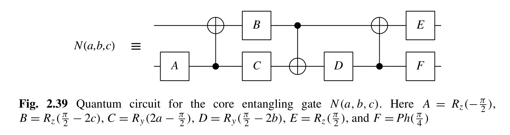

# Two-Qubit Gate Decomposition
**Main Challenge:**
An arbitrary two-qubit gate must be decomposed into some single-qubit gates and CNOT gates to be executed on a quantum computer.
Write a program to implement the two-qubit gate decomposition.

**Input:**

An arbitrary two-qubit gate (an arbitrary 4X4 unitary matrix).

**Output:** 

A sequence of single-qubit gates and CNOT gates.

**Example:**

 - Input:  a two-qubit Control-Z (CZ) gate on two qubits q1 and q2
 - Output: Hadamard gate (H) on q2, CNOT on q1 q2, Hadamard gate (H) on q2

## Step 1: Canonical Decomposition
Kraus and Cirac proposed a decomposition method [1] based on the isomorphism between
$SO(4)$ and $SU(2) \otimes SU(2)$. Thus, arbitrary unitary matrix $U$ can be decomposed like following:
$$
U = e^{i \theta_{0} I_2 \otimes I_2} L \cdot U_d \cdot R \\
U_d = \exp(i\sum_{k=1}^3 \theta_k \sigma_k \otimes\sigma_k)
$$
where $L$ and $R$ can be further decomposed into Kronecker products of two 2*2 unitary matrices, $\sigma_k$ is the corresponding Pauli matrix. It's worth noting that $U_d$ is responsible for the non-local characteristic of this two-qubit gate $U$.

In my implementation, I referred to KAK1 decomposition described in [2] and [3]. The method in [3] is not correct for the implementation of [gsvd()](https://www.mathworks.com/help/matlab/ref/gsvd.html) in Matlab. I also leveraged the generalized SVD function [gsvd()](https://www.mathworks.com/help/matlab/ref/gsvd.html) to simplify the code. However, the Matlab implementation didn't guarantee that $L \in SO(4)$ or $R \in SO(4)$, which both are needed for further decomposition in step 2. So I added some modification to make sure $|L|=|R|=1$. But then I figured out that the equation (14) and (16) in the paper do not hold true for all cases. So the correctness of decomposition from [3] is disputable. Then I went back to [2] and implement the decomposition correctly.

## Step 2: Decomposition of $L$ and $R$ 

$L$ and $R$ are both $SO(4)$ matrices which has the determinant of $1$. Due to the isomorphism between
$SO(4)$ and $SU(2) \otimes SU(2)$, we know these must exist two 2*2 unitary matrices of which the Kronecker product is the 4\*4 matrix.

I implemented the decomposition using element rearrangement and SVD. After reordering the elements, the new matrix can be rank-1. Then SVD will solve the two vectors corresponding to the biggest eigenvalue, which can be reordered into two 2*2 unitary matrices. This is a common method used in computer vision and other fields known as Nearest Kronecker Problem [4]. 

## Step 3: Decomposition of $U_d$

I implemented the optimal decomposition of $U_d$ proposed in [5]. The constructive proof is clear and straightforward.



Then we just need to combine the single-qubit gates and the overall decomposition can be described as follows.

```matlab
[R_a1, R_b1, R_a2, R_b2, R_b3, R_a4, R_b4] = gate_decomp(U)
% This function gives the decompostion of arbitrary 2-qubit gate.
% Final decompostion result:
%  =====      ======  =======  ======  ======          =======  ======
% -|   |-   --|R_a1|--|     |--|R_a2|--|    |----------|     |--|R_a4|--
%  | U |  =>  ======  |CNOT2|  ======  |CNOT|  ======  |CNOT2|  ======
% -|   |-   --|R_b1|--|     |--|R_b2|--|    |--|R_b3|--|     |--|R_b4|--
%  =====      ======  =======  ======  ======  ======  =======  ======
%
```

## References

[1] Optimal Creation of Entanglement Using a Two--Qubit Gate, https://arxiv.org/abs/quant-ph/0011050.

[2] An Introduction to Cartan's KAK Decomposition for QC Programmers, https://arxiv.org/abs/quant-ph/0507171.

[3] Universal quantum circuit for n-qubit quantum gate: A programmable quantum gate, https://arxiv.org/abs/quant-ph/0602174.

[4] Kronecker Decomposition for Image Classification, https://www.imageclef.org/system/files/CLEF2016_Kronecker_Decomposition.pdf.

[5] Optimal Quantum Circuits for General Two-Qubit Gates, https://arxiv.org/abs/quant-ph/0308006.